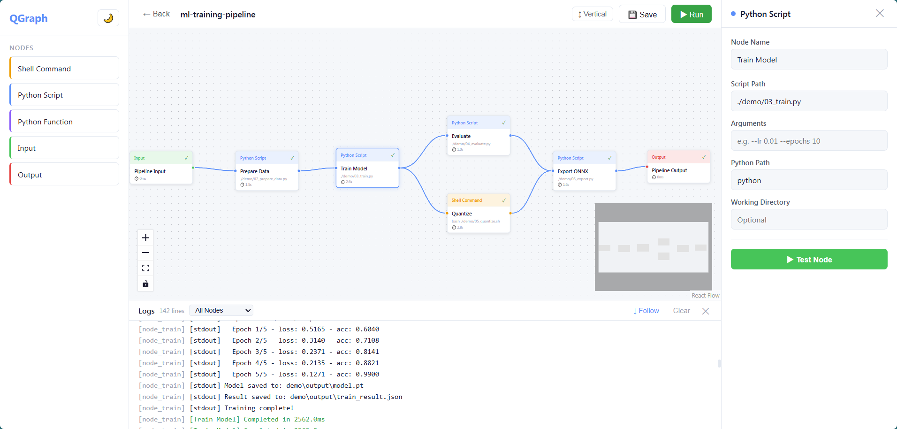

# QGraph

**轻量级可视化 Pipeline 编排工具**

> 版本：v0.1.5 · 作者：晓强 · License: MIT

将散乱的脚本组织为可视化 DAG 工作流。通过 Web UI 拖拽编排，CLI 一键运行。`pip install` 即开箱即用，无需 Node.js。

<p align="center">
  
</p>

---

## 特性

- **可视化编排** — 拖拽节点、连线构建 DAG 工作流
- **5 种节点类型** — Shell Command / Python Script / Python Function / Input / Output
- **并行执行** — DAG 拓扑排序，无依赖的节点自动并行
- **实时反馈** — WebSocket 日志推送 + 节点状态高亮动画
- **Input 参数传递** — Input 节点的参数自动注入为所有下游节点的环境变量
- **节点自测** — 单节点 Test 运行，实时日志输出，支持中断
- **断点续传** — Pipeline 失败后可从失败节点处 Resume，跳过已成功节点
- **Quick Add** — 双击画布粘贴命令，自动解析创建节点；多行脚本自动生成串行连线
- **项目级存储** — `qgraph init` 初始化本地 `.qgraph/`，图和日志跟随项目管理
- **AI 原生支持** — 自动生成 `QGRAPH.md`，AI 编码工具可直接创建和运行 Pipeline
- **轻量零依赖** — `pip install` 即用，前端打包在 Python 包内，无需 Node.js
- **双模式** — Web UI + CLI 行为完全一致，状态互通，`qgraph run` 不需要启动 Web 服务

---

## 为什么选 QGraph？

| | **QGraph** | Airflow | Prefect | n8n | Makefile |
|---|:---:|:---:|:---:|:---:|:---:|
| 安装方式 | `pip install` | DB + Scheduler + WebServer | pip + Cloud/Server | Docker / npm | 系统自带 |
| 需要基础设施 | ❌ 无 | PostgreSQL + Redis | Server / Cloud | Docker | 无 |
| 可视化编辑 | ✅ 拖拽画布 | Web UI（仅查看） | Web UI（仅查看） | ✅ 拖拽画布 | ❌ |
| 代码侵入性 | ❌ 零侵入 | 需要学 DAG DSL | 需要装饰器 | 低 | Makefile 语法 |
| 本地运行 | ✅ 直接跑 | 需部署 | 需 Agent | 需 Docker | ✅ |
| 现有脚本复用 | ✅ 直接拖入 | 需包装为 Operator | 需包装为 Task | 需适配 | 需重写 |
| 适合场景 | 个人/小团队脚本编排 | 企业级数据调度 | 团队级编排 | No-code 自动化 | 简单构建任务 |

**QGraph 的定位**：在 Makefile（太简陋）和 Airflow（太重）之间，为**个人开发者和小团队**提供一个**轻量、可视化、零配置**的 Pipeline 工具。

---

## 目录

- [为什么选 QGraph？](#为什么选-qgraph)
- [安装](#安装)
- [快速开始](#快速开始)
- [Web UI 使用指南](#web-ui-使用指南)
  - [Dashboard](#dashboard)
  - [编辑器](#编辑器)
  - [Quick Add](#quick-add)
  - [节点类型](#节点类型)
  - [节点配置](#节点配置)
  - [运行 Pipeline](#运行-pipeline)
  - [节点自测](#节点自测)
  - [断点续传](#断点续传)
- [CLI 命令参考](#cli-命令参考)
- [示例：ML 训练流水线](#示例ml-训练流水线)
- [数据存储](#数据存储)
- [AI 辅助集成](#ai-辅助集成)
- [技术架构](#技术架构)
- [开发指南](#开发指南)

---

## 安装

**系统要求**：Python ≥ 3.10

```bash
pip install qgraph
```

验证安装：

```bash
qgraph --version
```

---

## 快速开始

### 方式一：Web UI（推荐）

```bash
# 启动服务
qgraph serve

# 浏览器访问 http://localhost:9800
```

在 Dashboard 中创建一个新 Pipeline，进入编辑器，拖拽节点到画布，连线，配置，点击 Run。

### 方式二：CLI

```bash
# 列出所有 Pipeline
qgraph list

# 创建一个新的 Pipeline
qgraph create my-pipeline

# 启动 Web UI 编辑它
qgraph serve
# 浏览器打开 http://localhost:9800/?graph=my-pipeline

# 编辑完成后，CLI 直接运行（不需要启动 Web 服务）
qgraph run my-pipeline
```

---

## Web UI 使用指南

### Dashboard

访问 `http://localhost:9800`，Dashboard 是主控面板：

<p align="center">
  
</p>

- **Pipeline 列表**：查看所有已保存的 Pipeline，显示节点数量和更新时间
- **创建 Pipeline**：输入名称，点击 `+ Create` 或按 Enter
- **运行 Pipeline**：点击 `▶ Run` 按钮直接运行
- **删除 Pipeline**：点击 `Delete` 按钮（会弹出确认框）
- **实时运行状态**：正在运行的 Pipeline 会实时显示当前节点和进度
- **运行历史**：按时间排序的运行记录及其状态（completed / failed / stopped）
- **主题切换**：右上角 ☀️/🌙 按钮切换明暗主题

点击 Pipeline 名称或 `Edit` 按钮进入编辑器。

### 编辑器

编辑器由四个可拖拽调整大小的区域组成：

<p align="center">
  
</p>

```
┌──────────┬──────────────────────────────┬──────────┐
│          │         Toolbar              │          │
│  Sidebar │──────────────────────────────│  Config  │
│  (节点)   │                              │  Panel   │
│          │   画布 (Canvas)               │  (配置)   │
│  ←可拖拽→ │   拖拽节点，连线编排           │ ←可拖拽→  │
│          ├──────────────────────────────┤          │
│          │    Log Panel (日志，可过滤)    │          │
└──────────┴──────────────────────────────┴──────────┘
```

**画布操作**：

| 操作 | 方式 |
|------|------|
| 添加节点 | 从左侧 Sidebar 拖拽节点到画布 |
| 移动节点 | 直接拖拽画布上的节点 |
| 连线 | 从节点的输出端口拖线到另一个节点的输入端口 |
| 复制节点 | 选中节点后 `Ctrl+C`，`Ctrl+V` 粘贴 |
| 删除节点/连线 | 选中后按 `Delete` 或 `Backspace` |
| 缩放 | 鼠标滚轮 |
| 平移 | 按住鼠标右键拖动，或使用触控板 |
| Quick Add | 双击画布空白区域，弹出命令输入框 |

**工具栏按钮**：

| 按钮 | 功能 |
|------|------|
| ← Back | 返回 Dashboard |
| 💾 Save | 保存 Pipeline 到文件 |
| ▶ Run | 运行当前 Pipeline |
| ⏹ Stop | 停止正在运行的 Pipeline（运行中才显示） |
| ↻ Resume | 从失败节点处重新执行（上次运行失败时才显示） |

### Quick Add

双击画布空白区域弹出命令输入框，粘贴命令自动创建节点：

**单行命令**：

| 输入 | 生成节点 |
|------|---------|
| `python train.py --epochs 10` | Python Script（script_path=`train.py`, args=`--epochs 10`） |
| `CUDA=0 python train.py` | Python Script + env_vars `{CUDA: 0}` |
| `cd /data && python run.py` | Python Script + working_dir `/data` |
| `bash deploy.sh` | Shell Command |
| `npm run build` | Shell Command |

**多行脚本**（Shift+Enter 换行）：

```
cd /data/project
python prepare.py --input raw/
python train.py --epochs 50
python evaluate.py
bash deploy.sh
```

自动生成 4 个节点 + 串行连线，全部继承 `working_dir=/data/project`。

输入框底部会实时预览将要创建的节点和连线关系。

### 节点类型

QGraph 提供 5 种节点类型：

#### Shell Command（橙色 🟠）

执行任意 Shell 命令。

| 配置项 | 说明 | 示例 |
|--------|------|------|
| Command | Shell 命令 | `bash ./scripts/quantize.sh` |
| Working Dir | 工作目录（可选） | `./project` |
| Env Vars | 环境变量（可选） | `MODEL_PATH=./model.pt` |

#### Python Script（蓝色 🔵）

执行 Python 脚本文件。

| 配置项 | 说明 | 示例 |
|--------|------|------|
| Script Path | 脚本路径 | `./scripts/train.py` |
| Args | 命令行参数（可选） | `--epochs 10 --lr 0.001` |
| Python Path | Python 解释器（可选，默认 `python`） | `python3.12` |
| Working Dir | 工作目录（可选） | `./project` |
| Env Vars | 环境变量（可选） | `CUDA_VISIBLE_DEVICES=0` |

#### Python Function（紫色 🟣）

直接调用 Python 模块中的函数。

| 配置项 | 说明 | 示例 |
|--------|------|------|
| Module Path | Python 模块路径 | `my_package.utils` |
| Function Name | 函数名 | `process_data` |
| Kwargs | 关键字参数（可选） | JSON 格式 |

函数支持同步和异步（`async def`）。

#### Input（绿色 🟢）

Pipeline 的入口节点。定义全局参数，**自动注入为所有下游节点的环境变量**。

| 配置项 | 说明 | 示例 |
|--------|------|------|
| Parameters | 键值对，自动传递给下游 | `EPOCHS=10`, `LR=0.001` |

- 下游节点通过 `os.getenv("EPOCHS")` (Python) 或 `%EPOCHS%` (Win) / `$EPOCHS` (Linux) 访问
- 节点自身的 `env_vars` 优先级更高，可覆盖 Input 传递的同名参数

#### Output（红色 🔴）

Pipeline 的出口节点。标记 Pipeline 的结束点。

### 节点配置

点击画布上的节点，右侧会打开配置面板：

1. **名称**：修改节点显示名称
2. **类型相关配置**：根据节点类型显示不同的配置表单
3. **环境变量**：为节点执行设置环境变量键值对

编辑完配置后会自动保存到节点，但需要点击工具栏的 `Save` 按钮才会持久化到文件。

### 运行 Pipeline

**通过 Web UI 运行**：

1. 点击工具栏 `▶ Run` 按钮
2. 节点状态实时更新：
   - ⚪ 灰色：等待中（idle）
   - 🟡 黄色脉冲：排队中（queued）
   - 🟡 旋转图标：执行中（running）
   - 🟢 绿色：成功（success）
   - 🔴 红色：失败（failed）
3. 底部 Log Panel 实时显示每个节点的标准输出和错误输出
4. 如果需要停止，点击 `⏹ Stop` 按钮

**执行逻辑**：

- 使用 DAG 拓扑排序（Kahn 算法）确定执行顺序
- 没有依赖关系的节点自动并行执行
- 汇合节点会等待所有上游节点完成后才开始
- 如果任意节点失败，其**所有下游节点自动跳过**（skipped），不再执行

### 节点自测

在 ConfigPanel 中点击 **▶ Test Node** 按钮，可以单独运行选中的节点：

<p align="center">
  
</p>

- 实时日志输出（通过 WebSocket 推送）
- 自动注入同一图中 Input 节点的参数
- 支持超时控制（默认 30s，上限 120s）
- 运行中可点击 **⏹ Stop Test** 中断
- 显示测试结果：✓ Passed / ✗ Failed / ⏱ Timeout / ⏹ Cancelled

### 断点续传

Pipeline 运行失败后，工具栏会出现 **↻ Resume** 按钮：

- 点击 Resume 会跳过所有已成功的节点，只重新执行失败和被跳过的节点
- 即使关闭浏览器重新打开，Resume 状态也会自动恢复（从运行日志中读取）
- 修改失败节点的配置后再 Resume，非常适合调试场景

---

## CLI 命令参考

### 服务管理

```bash
qgraph serve                     # 启动 Web UI 服务（默认 http://0.0.0.0:9800）
qgraph serve --port 9801         # 指定端口
qgraph serve --host 127.0.0.1   # 限制本地访问
```

### Pipeline 管理

```bash
qgraph init                      # 初始化当前目录为 QGraph 项目（创建 .qgraph/）
qgraph list                      # 列出所有 Pipeline（本地 + 全局）
qgraph create <name>             # 创建新 Pipeline
qgraph edit <name>               # 打印编辑器 URL
qgraph delete <name>             # 删除 Pipeline
```

### 运行管理

```bash
qgraph run <name>                # 运行 Pipeline（前台，实时输出日志）
qgraph ps                        # 列出运行中的任务（基于 PID 检测，不需要 serve）
qgraph ps -a                     # 列出所有任务（运行中 + 历史记录）
qgraph logs <run_id>             # 查看某次运行的详细日志
qgraph stop <run_id>             # 停止运行中的任务
```

### 导入/导出

```bash
qgraph export <name>             # 导出为 JSON（默认 <name>.json）
qgraph export <name> -o out.json # 指定导出路径
qgraph import pipeline.json      # 从 JSON 导入 Pipeline
```

### 注意事项

- `qgraph run` 不需要启动 Web 服务，直接读取本地 JSON 文件执行
- `qgraph ps` 基于 PID 文件检测运行中任务，不需要 Web 服务
- `qgraph ps -a` 从本地日志文件读取所有历史记录
- CLI 和 Web UI 共享同一套运行状态和日志系统，行为完全一致

---

## 示例：ML 训练流水线

QGraph 自带一个完整的 ML 训练流水线示例：`ml-training-pipeline`。

### 流水线结构

```
[Input] → [Prepare Data] → [Train Model] → [Evaluate]    → [Export ONNX] → [Output]
                                          → [Quantize]  ↗
```

- **Input**：定义初始参数（epochs、学习率、输出目录等）
- **Prepare Data**：生成训练数据（`demo/02_prepare_data.py`）
- **Train Model**：模拟模型训练（`demo/03_train.py`）
- **Evaluate** + **Quantize**：训练完成后并行执行评估和量化
- **Export ONNX**：等待评估和量化都完成后，导出模型
- **Output**：收集最终结果

### 运行示例

```bash
# CLI 运行
qgraph run ml-training-pipeline

# 查看运行日志
qgraph logs <run_id>
```

输出示例：

```
Running graph: ml-training-pipeline

  ✓ Config → success
  ✓ Prepare Data → success
    Inherited 4 params from Input: OUTPUT_DIR, LEARNING_RATE, EPOCHS, NUM_SAMPLES
    Running: python ./demo/02_prepare_data.py
  ✓ Train Model → success        ⏱ 1.2s
  ⟳ Evaluate → running           # 并行执行
  ⟳ Quantize → running           # 并行执行
  ✓ Evaluate → success           ⏱ 0.5s
  ✓ Quantize → success           ⏱ 0.3s
  ✓ Export ONNX → success
  ✓ Output → success

Pipeline completed successfully: 7 nodes
```

---

## 数据存储

QGraph 支持两种存储模式：

### 项目级存储（推荐）

```bash
cd /my/project
qgraph init
```

```
/my/project/
├── .qgraph/
│   ├── graphs/              # Pipeline 定义（跟随项目，可 git 管理）
│   ├── logs/                # 运行日志
│   └── running/             # 运行中状态（PID 文件）
├── train.py
└── ...
```

### 全局存储

不执行 `qgraph init` 时，图和日志存储在用户主目录：

```
~/.qgraph/
├── graphs/                  # 全局 Pipeline 定义
├── logs/                    # 运行日志
└── running/                 # 运行中状态
```

全局图会自动记录 `project_dir`（创建时的工作目录），执行时自动 `cd` 到该目录，确保在任何位置运行都能找到正确的文件路径。

- **graphs/**：每个 Pipeline 一个 JSON 文件，包含节点、连线、位置信息和配置
- **logs/**：每次运行一个 JSON 文件，包含运行 ID、状态、节点状态和完整日志
- **running/**：运行中进程的状态文件（PID + 开始时间），进程结束自动清理

Pipeline JSON 文件可以直接用 `qgraph export` / `qgraph import` 进行备份和共享。

---

## AI 辅助集成

QGraph 对 AI 编码工具（Cursor、Trae、Copilot、Claude 等）提供原生支持。

执行 `qgraph init` 时，会在项目根目录自动生成 `QGRAPH.md` 文件。这个文件包含 QGraph 的完整使用指南，任何 AI 编码工具打开项目时都会自动读取，从而了解如何使用 QGraph。

**AI 可以做什么**：

- 根据用户需求自动生成 Pipeline JSON 文件
- 直接写入 `.qgraph/graphs/` 目录
- 建议使用 `qgraph run` 或 `qgraph serve` 运行
- 理解节点类型、连线、参数传递等完整语义

**示例交互**：

```
用户：帮我创建一个 Pipeline，先跑 prepare.py，再并行跑 train.py 和 evaluate.py，最后跑 export.py
AI：（读取 AGENTS.md 后，直接生成正确格式的 JSON 到 .qgraph/graphs/）
     运行：qgraph run my-pipeline
```

---

## 技术架构

```
┌─────────────────────────────────────────────────────────────┐
│                      pip install qgraph                      │
│                                                              │
│  ┌──────────────┐          ┌──────────────────────────┐      │
│  │   CLI (click) │          │   Web UI (React + Vite)  │      │
│  │              │          │                          │      │
│  │  serve       │          │  Dashboard               │      │
│  │  run         │          │  Editor (React Flow)     │      │
│  │  list/ps/... │          │  Config / Log Panel      │      │
│  └──────┬───────┘          └────────────┬─────────────┘      │
│         │                               │                    │
│         ▼                               ▼                    │
│  ┌──────────────────────────────────────────────────────┐    │
│  │              FastAPI 服务层 (:9800)                    │    │
│  │  REST API (/api/graphs/*, /api/runs/*)               │    │
│  │  WebSocket (/ws/graph/*, /ws/dashboard)              │    │
│  └──────────────────────┬───────────────────────────────┘    │
│                         ▼                                    │
│  ┌──────────────────────────────────────────────────────┐    │
│  │              调度引擎层                                │    │
│  │  RunManager (运行状态) → PipelineExecutor (DAG 调度)  │    │
│  │  Kahn 拓扑排序 → asyncio.gather 并行执行              │    │
│  └──────────────────────┬───────────────────────────────┘    │
│                         ▼                                    │
│  ┌──────────────────────────────────────────────────────┐    │
│  │              执行层                                    │    │
│  │  Shell → subprocess  |  Script → subprocess           │    │
│  │  Function → importlib.import_module                   │    │
│  │  stdout/stderr 逐行实时读取 → on_log 回调             │    │
│  └──────────────────────────────────────────────────────┘    │
│                                                              │
│  存储：~/.qgraph/ 或 .qgraph/（graphs + logs + running）
└─────────────────────────────────────────────────────────────┘
```

| 层 | 技术选型 |
|-----|----------|
| 前端 | React 18 + TypeScript + React Flow (@xyflow/react) + Vite 5 |
| 后端 | Python 3.10+ + FastAPI + asyncio + uvicorn |
| CLI | click + rich |
| 存储 | JSON 文件 |
| 打包 | pyproject.toml + hatchling |

---

## 开发指南

### 环境搭建

```bash
# 克隆仓库
git clone <repo-url>
cd QGraph

# 安装 Python 包（editable 模式）
pip install -e .

# 安装前端依赖
cd web && npm install && cd ..
```

### 开发模式

```bash
# 同时启动后端 + 前端 dev server
python dev.py

# 或分别启动：
qgraph serve                    # 后端（端口 9800）
cd web && npm run dev           # 前端（端口 5173，proxy 到 9800）
```

### 代码检查

```bash
# Python lint
ruff check src/

# TypeScript 类型检查
cd web && npx tsc --noEmit
```

### 前端构建

```bash
cd web && npm run build
# 输出到 src/qgraph/web/dist/，通过 qgraph serve 直接 serve
```

### 发布

```bash
python release.py                    # 构建 wheel
python release.py --publish          # 自动 bump patch + 构建 + 上传 PyPI
python release.py --bump minor       # bump minor 版本 + 构建
python release.py --bump 1.0.0       # 设置精确版本号 + 构建
```

### 项目结构

```
QGraph/
├── src/qgraph/                 # Python 后端
│   ├── cli.py                  # CLI 入口（11 个命令）
│   ├── core/                   # 模型 + 存储
│   │   ├── models.py           # Pydantic 数据模型
│   │   └── storage.py          # JSON 文件读写
│   ├── engine/                 # 执行引擎
│   │   ├── executor.py         # DAG 拓扑排序 + 并行调度
│   │   └── run_manager.py      # 运行状态追踪 + 日志持久化
│   └── server/                 # Web 服务
│       ├── app.py              # FastAPI app 工厂
│       ├── api.py              # REST API 路由
│       └── ws.py               # WebSocket 管理
├── web/                        # React 前端
│   └── src/
│       ├── App.tsx             # 路由：Dashboard / EditorView
│       ├── api.ts              # 后端 API 封装
│       ├── types.ts            # TypeScript 类型
│       └── components/         # UI 组件
│           ├── Dashboard.tsx   # Pipeline 管理面板
│           ├── PipelineNode.tsx # 自定义画布节点
│           ├── Sidebar.tsx     # 左侧节点面板
│           ├── Toolbar.tsx     # 顶部工具栏
│           ├── ConfigPanel.tsx # 右侧配置面板
│           ├── LogPanel.tsx    # 底部日志面板
│           └── QuickAdd.tsx    # 快速创建节点（命令解析）
├── demo/                       # 测试脚本（10 个）
├── tests/                      # 自动化测试
│   └── test_smoke.py           # Smoke test（30 项检查）
├── pyproject.toml              # Python 包配置
├── release.py                  # 发布脚本（版本管理 + 构建 + PyPI）
└── dev.py                      # 开发启动脚本
```

---

## License

MIT
